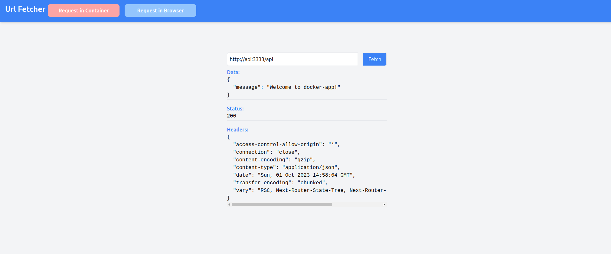
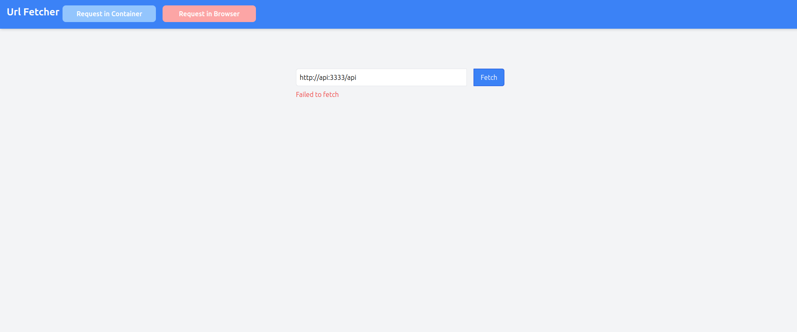
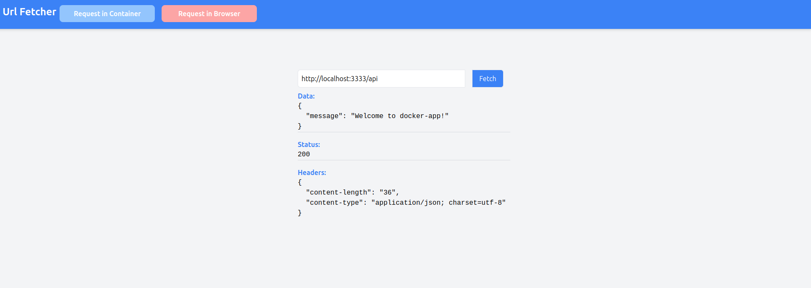

# Readme: Networking and Request Handling between Docker Containers

This guide provides an illustration of the intricacies involved in making API requests within a Docker network, primarily focusing on the connectivity between a Next.js frontend container (`ui-docker-app`) and an Express backend container (`docker-app`). Here’s a structured overview of the essential points.

## Getting Started

### Prerequisite
- Ensure Docker and Docker Compose are installed on your machine.

### Running the Applications
- Execute the following command to run both applications in detached mode:
  ```
  docker-compose up -d
  ```

## Applications Overview

1. **docker-app**: A simplistic Express backend.
2. **ui-docker-app**: A simplistic Next.js frontend where you can input a URL and visualize the request response.

## Functionality

### User Interface
- The user can input a URL in the UI to see the corresponding request response.
- Specifically, users are encouraged to input the URL of the backend to attempt a connection to it.

### Connection Mechanisms
- There are two distinct buttons, representing different methods to connect to the API:
   1. **Connect via Next.js Endpoint**: Initiates a request to a Next.js endpoint which then calls the Express API endpoint.
   2. **Connect via Browser**: Makes the call to the API directly in the browser.

## Concepts Demonstrated

### Container Networking
- This demonstration aims to clarify that even if our UI container exists within the same network, attempting to point to the service name as if it’s a host on the browser (in an API request on the frontend) will fail.

Here is a successful request in the browser




Here is an unsuccessful request in the browser



### Layer 7 (L7) Layer Pointing
- For successful API URL pointing in the browser, it must be directed to the L7 layer.




### API Route Handling in Next.js
- A workaround when utilizing Next.js is to employ the API route handlers in Next.js and initiate the call to the service name on the Next.js server itself.

## Objective

This project and article aim to elucidate the subtleties and nuances in establishing connections and making requests between containers in Docker, particularly focusing on API requests between a frontend and a backend container. It helps to understand the considerations and adaptations required in a containerized environment to maintain seamless interoperability between different components of an application.

### Conclusion

Understanding these nuances is crucial in developing robust containerized applications and avoiding common pitfalls related to inter-container communications, ensuring the overall integrity and functionality of the applications.There is a lot more nuances and other concepts that I can get into, however, I am trying to keep it really simple for now and explain the basics.